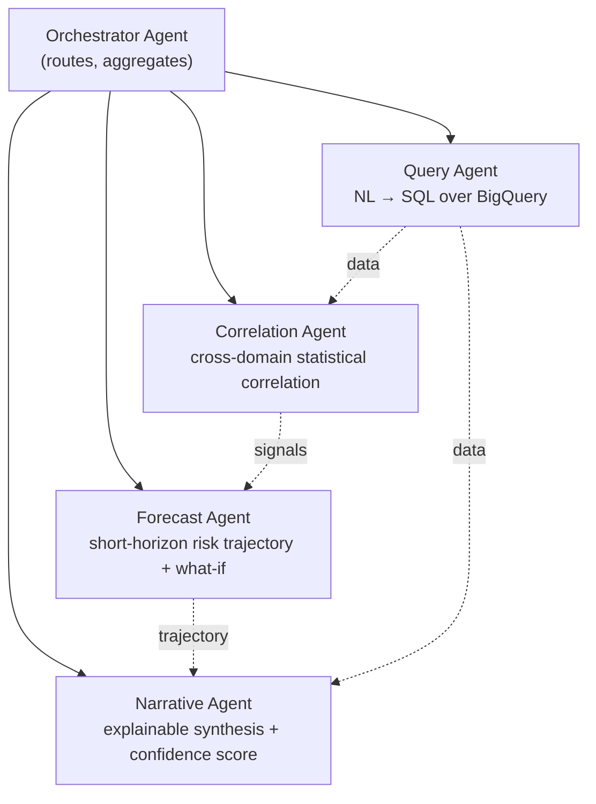

# AI.md — AI / Agent Architecture

## Part 7 — Single Agent vs. Multi-Agent: The Decision

| Criterion | Single Agent | Multi-Agent (ADK Workflow Runtime) |
|---|---|---|
| Reasoning transparency for judges | One black-box call | **Each step is a visible node** — directly serves the "visible agentic reasoning" scoring lever from PRD.md Part 1 |
| Prompt complexity | One giant prompt trying to do NL→SQL, stats, forecasting, and narrative | Each agent has a narrow, testable instruction — far more reliable under time pressure |
| Latency control | All-or-nothing | Can parallelize independent steps (fan-out) via Workflow Runtime |
| Failure isolation | One failure = no answer | A failed specialist can retry/fallback without killing the whole run (native to ADK 2.0's graph engine) |
| Demo value | Low — looks like "just a chatbot" | High — the graph animating live *is* the demo's centerpiece |

**Decision: Multi-agent, orchestrated by ADK 2.0's Workflow Runtime.** This is not over-engineering for its own sake — it's the single highest-leverage architectural choice for how this hackathon is judged (see PRD.md Part 1.3).

## Agent Roster

| Agent | Model | Tools | Output |
|---|---|---|---|
| Orchestrator | Gemini 3 Flash | none (routing logic + ADK Task API delegation) | Execution plan, aggregated result |
| Query | Gemini 3 Flash | MCP BigQuery connector | Structured rows + generated SQL (shown to user for trust) |
| Correlation | Gemini 3 Flash | Python code execution (stats: rolling z-score, co-occurrence window) | Correlation signals + severity score |
| Forecast | Gemini 3 Flash | Python code execution (lightweight time-series projection) | Risk trajectory, what-if response |
| Narrative | **Gemini 3.1 Pro** | RAG Engine (stretch — policy doc grounding) | Situation Brief text + confidence score + recommended action |

## Why This Model Split

- **Gemini 3 Flash** for every intermediate agent step: cheap, fast, "high-volume, low-latency" per its own positioning — keeps the live demo snappy (target: full pipeline in under ~12s).
- **Gemini 3.1 Pro** reserved for exactly one call — the final narrative synthesis — where its stronger reasoning and larger context window earn their higher cost/latency, because it's reading the combined output of all upstream agents at once.

## Tool Calling & MCP

Agents don't call BigQuery's client library directly — they call it **through a managed MCP connector** (Cloud API Registry). This matters for two reasons:
1. **Governance-by-default** — the connector is scoped read-only to the demo dataset, so a hallucinated or injected query cannot mutate data.
2. **Judging signal** — MCP-managed tool access is a 2026-native Google Cloud capability; using it (instead of a hand-rolled REST wrapper) is a visible sign the build tracks current Google Cloud practice.

## Memory

| Layer | MVP | Stretch |
|---|---|---|
| Within-session | ADK Session object holds the conversation + intermediate agent state | — |
| Cross-session | Not built | **Memory Bank** (Agent Platform's managed long-term memory) — would let AEGIS recall "you asked about Sector 7 yesterday too" across visits |

## RAG (Grounding)

Should-Have, not Must-Have: 5–10 seeded short "emergency response protocol" documents embedded via RAG Engine / Vector Search, retrieved by the Narrative Agent so recommendations cite a real protocol clause rather than free-floating LLM opinion. If time runs out, the Narrative Agent still works — it just grounds purely on the upstream agents' structured output instead of policy text.

## Explainability & Confidence Scoring

Every Situation Brief carries:
- **A confidence score** (0–100) derived deterministically from: (a) how many independent domains corroborate the signal, (b) recency of the underlying data, (c) statistical strength of the correlation (not just an LLM's self-reported confidence — this avoids the classic "model says 95% confident about a hallucination" trap).
- **A one-paragraph "why"** naming the specific rows/signals used, generated by the Narrative Agent but constrained to only reference IDs actually present in the upstream agents' structured output (grounding constraint, reduces hallucination risk — see RISKS.md).
- **The generated SQL** shown in an expandable panel — lets a technical judge verify the Query Agent isn't faking results.

## What-If Simulation

The what-if slider (e.g. "+20% rainfall intensity") re-invokes only the **Forecast Agent** with an adjusted parameter, short-circuiting Query/Correlation — this is what keeps the interaction fast enough (~2–3s) to feel like a live simulation rather than a full re-query.
