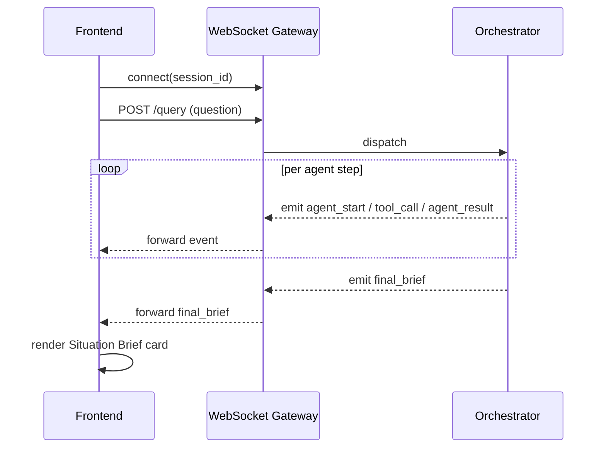

# API.md — API Design & Contracts

## Endpoint Table

| Method | Path | Purpose |
|---|---|---|
| `POST` | `/api/v1/query` | Submit an NL question; triggers the ADK agent workflow |
| `GET` | `/api/v1/briefs/{sector_id}` | Fetch latest Situation Brief for a sector |
| `GET` | `/api/v1/sectors` | List sectors + current map markers (risk color-coding) |
| `POST` | `/api/v1/whatif` | Re-run Forecast Agent with adjusted parameters |
| `GET` | `/api/v1/history/{session_id}` | Retrieve prior queries/briefs for the session |
| `WS` | `/ws/agent-events/{session_id}` | Streams live agent graph events (node start/tool-call/result) |
| `GET` | `/healthz` | Liveness/readiness probe for Cloud Run |

## Example — `POST /api/v1/query`

**Request**
```json
{
  "session_id": "sess_8f21",
  "question": "What's happening in Sector 7 right now?"
}
```

**Response**
```json
{
  "brief_id": "brief_2291",
  "sector_id": "sector_07",
  "risk_score": 78,
  "confidence": 0.86,
  "recommendation": "Deploy backup power unit to Sector 7 substation within 2 hours; monitor drainage at Elm St crossing.",
  "narrative": "A 34% spike in citizen reports (waterlogging, power loss) in Sector 7 over the last 3 hours coincides with a flagged heavy-rain event and an active utility outage — three independent signals corroborating the same window and location.",
  "sources": {
    "sql": "SELECT ... FROM core.citizen_feedback WHERE sector_id = 'sector_07' ...",
    "signals_used": ["feedback_spike", "weather_event_412", "utility_status_88"]
  },
  "generated_at": "2026-07-05T14:22:00Z"
}
```

## Example — `POST /api/v1/whatif`

**Request**
```json
{
  "brief_id": "brief_2291",
  "adjustment": { "rainfall_intensity_pct": 20 }
}
```

**Response**
```json
{
  "brief_id": "brief_2291",
  "adjusted_risk_score": 91,
  "delta": 13,
  "narrative_delta": "A further 20% rainfall increase pushes Sector 7 past the drainage threshold within ~90 minutes, based on the current outage-response ETA."
}
```

## WebSocket Event Stream — `/ws/agent-events/{session_id}`

```json
{ "type": "agent_start", "agent": "query", "ts": "..." }
{ "type": "tool_call", "agent": "query", "tool": "bigquery_mcp", "detail": "SELECT ..." }
{ "type": "agent_result", "agent": "query", "summary": "42 rows returned" }
{ "type": "agent_start", "agent": "correlation" }
{ "type": "agent_result", "agent": "correlation", "summary": "3 corroborating signals found" }
{ "type": "final_brief", "brief_id": "brief_2291" }
```
Frontend maps each event onto a React Flow node state transition (`idle → active → done`), which is the entire mechanism behind the "live agent graph" demo centerpiece.

## Auth

MVP: Firebase Auth ID token passed as `Authorization: Bearer <token>`, verified by FastAPI middleware. No role differentiation in the 24h build; documented in ARCHITECTURE.md as a Phase-2 item.

## Sequence — WebSocket Lifecycle


