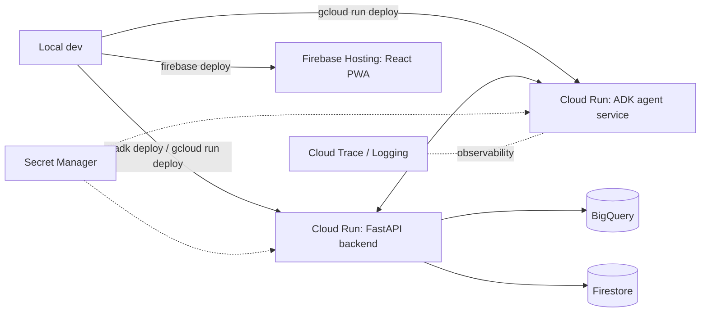
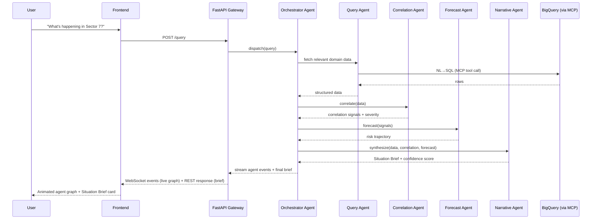
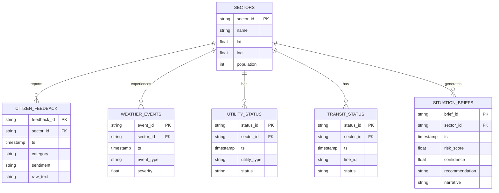

# ARCHITECTURE.md — System Architecture

## 1. High-Level System Diagram

```mermaid
flowchart TB
    subgraph Client["Frontend — React/Vite PWA (Firebase Hosting)"]
        UI[Situation Room UI]
        Graph[React Flow — live agent graph]
        Map[MapLibre — situation map]
        Chat[NL query box]
    end

    subgraph Backend["FastAPI Backend — Cloud Run"]
        API[REST + WebSocket Gateway]
        Auth[Auth middleware]
    end

    subgraph Agents["ADK 2.0 Workflow Runtime — Agent Service (Cloud Run)"]
        Orch[Orchestrator Agent]
        Query[Query Agent]
        Corr[Correlation Agent]
        Fore[Forecast Agent]
        Narr[Narrative Agent]
    end

    subgraph Tools["MCP Tool Layer — Cloud API Registry"]
        MCPBQ[BigQuery MCP Connector]
        MCPMaps[Maps MCP Connector]
    end

    subgraph Data["Data Layer"]
        BQ[(BigQuery — analytics core)]
        FS[(Firestore — session/live state)]
        GCS[(Cloud Storage — seeded raw data)]
        VS[(Vector Search / RAG Engine — stretch)]
    end

    subgraph Models["Gemini Enterprise Agent Platform"]
        Flash[Gemini 3 Flash]
        Pro[Gemini 3.1 Pro]
    end

    Chat --> API
    API --> Auth --> Orch
    Orch --> Query --> MCPBQ --> BQ
    Orch --> Corr --> BQ
    Orch --> Fore --> BQ
    Orch --> Narr --> VS
    Query --> Flash
    Corr --> Flash
    Fore --> Flash
    Narr --> Pro
    Orch -. streamed events .-> API
    API -. Socket.IO .-> Graph
    API --> FS
    GCS --> BQ
    Corr --> Map
```

## 2. Component Breakdown

| Component | Responsibility |
|---|---|
| Situation Room UI | Primary screen: map + timeline + NL query box + Situation Brief panel |
| React Flow agent graph | Renders live node/edge state as ADK streams Workflow Runtime events over Socket.IO |
| FastAPI Gateway | Auth, request validation (Pydantic), REST endpoints, WebSocket bridge to agent events |
| Orchestrator Agent | Parses intent, decides which specialist agents to invoke, in what order (ADK Workflow graph) |
| Query Agent | Translates NL question → BigQuery SQL via MCP BigQuery connector, executes, returns rows |
| Correlation Agent | Runs statistical cross-domain correlation over returned data (e.g. complaint spike × weather event × outage report, same sector/time window) |
| Forecast Agent | Produces short-horizon risk trajectory + supports what-if re-runs with adjusted parameters |
| Narrative Agent | Synthesizes all agent outputs into an explainable Situation Brief with confidence score (Gemini 3.1 Pro, optionally RAG-grounded on policy docs) |

## 3. Authentication

MVP: single demo-account Firebase Auth (email/password or anonymous session) — enough to demonstrate a real auth boundary without burning hours on RBAC. Documented (not built): role-based access (citizen vs. official vs. admin) via Firebase custom claims + IAM-backed service-to-service auth between Cloud Run services.

## 4. Workflow Engine & Event System

- **ADK 2.0 Workflow Runtime** is the workflow engine — a graph-based execution engine (the same primitive used for retries, fan-out/fan-in, state) replaces any need for a bespoke workflow layer.
- Each node emits a structured event (`agent_start`, `tool_call`, `agent_result`) — the backend relays these over a WebSocket channel the frontend consumes to animate the React Flow graph in real time.
- **Stretch:** Pub/Sub + Eventarc for a scheduled re-ingestion trigger (Cloud Scheduler → Pub/Sub → Cloud Function → BigQuery load) — documented, not required for the live demo path.

## 5. Deployment Architecture



## 6. Monitoring & Security

| Concern | Approach |
|---|---|
| Observability | ADK 2.0's native OpenTelemetry hooks → Cloud Trace; structured logs → Cloud Logging |
| Secrets | Service account keys / API keys in Secret Manager, never in frontend bundle |
| Prompt injection | Model Armor-style input sanitization documented as a post-hackathon hardening step (see RISKS.md) |
| Least privilege | Cloud Run service accounts scoped to only BigQuery read + Firestore read/write, no broader project IAM |
| Data boundary | MCP BigQuery connector restricted to read-only, whitelisted dataset — agents cannot mutate source data |

## 7. Sequence Diagram — Query to Situation Brief



## 8. Entity Relationship Diagram (BigQuery core tables)


