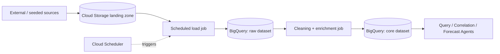

# DATA.md — Data Architecture & Pipelines

## Domain Coverage Map

| Brief's domain | AEGIS table | 24h source |
|---|---|---|
| Transportation | `TRANSIT_STATUS` | Seeded synthetic feed (line status, delays) |
| Citizen Feedback | `CITIZEN_FEEDBACK` | Seeded synthetic complaints w/ realistic text, LLM-assisted generation |
| Weather | `WEATHER_EVENTS` | Real API pull (Open-Meteo or similar free tier) blended with seeded severe-event rows |
| Utility Networks / Energy | `UTILITY_STATUS` | Seeded synthetic outage/status feed |
| Disaster Data | folded into `WEATHER_EVENTS.event_type` (flood/storm flags) | Seeded |
| Healthcare, Public Services, Education, Community Programs, Social Platforms, Environment | **Documented as Phase-2 tables**, not built for MVP — see ROADMAP.md | — |

Seeding all-synthetic-but-realistic data for a demo is standard and expected hackathon practice; the pipeline design below is what would ingest real feeds post-hackathon without a schema change.

## Pipeline

## Ingest → Clean → Enrich → Classify → Summarize → Cluster → Anomaly → Forecast → Explain

| Stage | What happens | How |
|---|---|---|
| **Ingest** | Land raw CSV/JSON in Cloud Storage, batch-load into a `raw` BigQuery dataset | `bq load` / scheduled Cloud Function |
| **Clean** | Null-handling, timestamp normalization, sector_id join-key validation | SQL transform (scheduled query) into `core` dataset |
| **Enrich** | Attach sector metadata (population, coordinates) for map plotting | SQL join at load time |
| **Classify** | Citizen feedback tagged by category (infrastructure/safety/health/other) and sentiment | Gemini 3 Flash batch classification pass at ingest time (cheap, done once, not per-query) |
| **Summarize** | Per-sector daily rollups (feedback volume, avg sentiment, event counts) | BigQuery scheduled query → summary table, used by Correlation Agent for fast lookups |
| **Cluster** | Group similar feedback text to spot emerging themes (e.g. many independent "no power" reports) | Lightweight embedding + cosine clustering (stretch) or simple keyword clustering (MVP) |
| **Detect anomalies** | Flag sector/time windows where feedback volume or severity deviates from rolling baseline | Correlation Agent computes rolling z-score in-query |
| **Forecast** | Project risk trajectory forward N hours given current signal trend | Forecast Agent, simple exponential/linear projection (appropriate for demo horizon; documented as the place to swap in a real BigQuery ML model post-hackathon) |
| **Explain** | Turn the above into a plain-English, cited narrative | Narrative Agent (Gemini 3.1 Pro), constrained to reference only IDs present in upstream output |

## Why BigQuery Is the System of Record (not just a bolt-on)

This is deliberate, not incidental — the hackathon's own theme is "Unified Data Analytics," and Track 1 explicitly rewards "conversational agents directly inside BigQuery." Every agent reasoning step ultimately resolves to a BigQuery query executed via the MCP connector, so the demo directly satisfies the theme rather than merely gesturing at it.

## Post-Hackathon Data Roadmap (documented, not built)

- Real feeds: municipal 311/complaint APIs, national weather services, utility SCADA exports (aggregated, non-operational)
- Governance: column-level access controls in BigQuery, PII redaction (DLP API) before load
- Freshness: Pub/Sub-driven streaming inserts instead of scheduled batch loads
