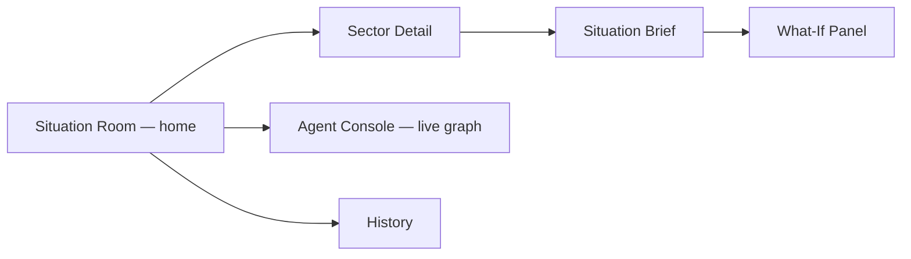
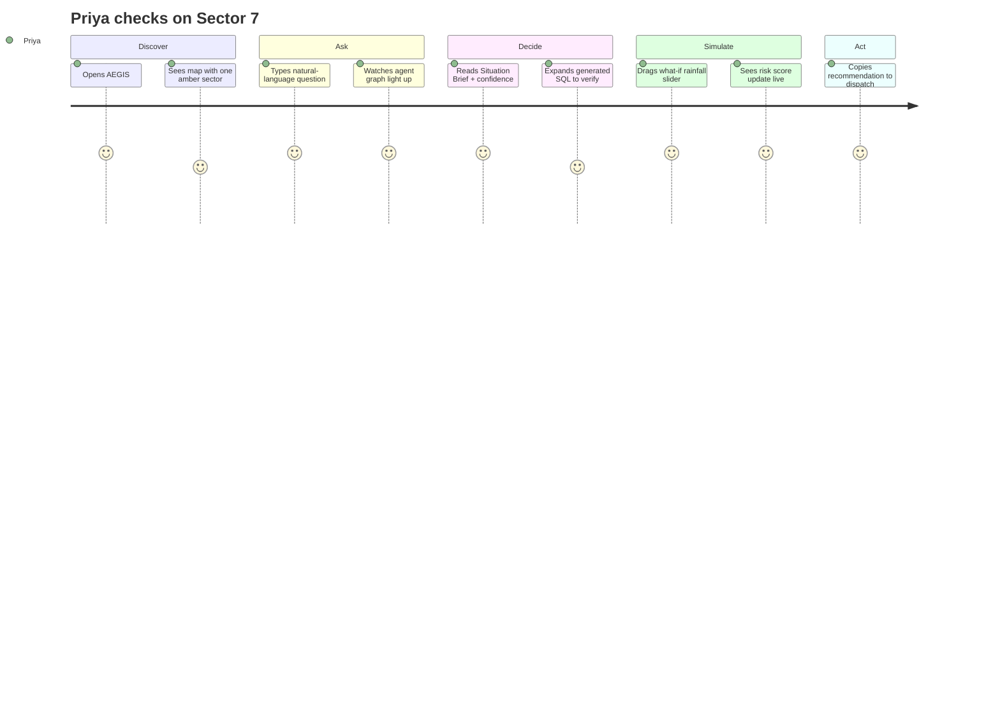

# DESIGN.md — UX / UI & Interaction Design

## Part 10/11 — Design Philosophy

Reference points and what each contributes:

| Inspiration | What we borrow |
|---|---|
| **Linear** | Keyboard-first speed, restrained color, dense-but-calm information hierarchy |
| **Vercel Dashboard** | Dark-mode-first, monospace data callouts, crisp card borders |
| **Arc Browser** | Playful motion on state transitions (Framer Motion), soft gradients |
| **Stripe** | Trustworthy data presentation — numbers feel *precise*, not decorative |
| **Google Material 3** | Elevation system, accessible contrast, motion easing curves |
| **Palantir Foundry** | The "operational situation room" feeling — map + timeline + entity graph as co-equal panels, not a chat window bolted onto a sidebar |
| **Notion AI** | Copilot panel feels conversational, not form-like |

**AEGIS's own visual identity:** dark cyberpunk-adjacent civic-command aesthetic — deep navy/graphite base, one accent (amber/cyan) reserved *only* for risk signals, so color always carries meaning rather than decoration.

## Screen Map



## Situation Room — Layout Sketch (ASCII)

```
┌───────────────────────────────────────────────────────────────┐
│  AEGIS   [Search sectors...]                    ⚙  👤 Priya   │
├───────────────────┬───────────────────────────────────────────┤
│                   │  Ask AEGIS anything...                    │
│                   │  ┌─────────────────────────────────────┐  │
│     MAP           │  │ "What's happening in Sector 7?"      │  │
│  (MapLibre,       │  └─────────────────────────────────────┘  │
│  risk-colored     │                                            │
│  sector markers)  │  ┌── Agent Console (React Flow) ────────┐ │
│                   │  │  [Orchestrator]                       │ │
│                   │  │     ├─▶ [Query]  ●active              │ │
│                   │  │     ├─▶ [Correlation]  ○idle           │ │
│                   │  │     ├─▶ [Forecast]  ○idle              │ │
│                   │  │     └─▶ [Narrative]  ○idle             │ │
│                   │  └────────────────────────────────────────┘ │
├───────────────────┴───────────────────────────────────────────┤
│  TIMELINE  ▬▬▬▬▬●▬▬▬▬▬▬▬▬▬▬▬▬▬▬▬▬▬▬▬▬▬▬▬▬▬▬▬▬▬▬▬▬▬▬▬▬▬▬▬▬▬  │
└───────────────────────────────────────────────────────────────┘
```

## Situation Brief Card — Layout Sketch

```
┌─────────────────────────────────────────────┐
│  SECTOR 7 · RISK 78/100  ⚠ ELEVATED          │
│  Confidence: 86%                             │
│                                               │
│  "A 34% spike in citizen reports              │
│   (waterlogging, power loss) coincides        │
│   with a flagged heavy-rain event and an      │
│   active utility outage."                    │
│                                               │
│  ▸ Recommendation                             │
│    Deploy backup power unit within 2 hours    │
│                                               │
│  ▸ Show generated SQL          ▸ Show signals │
│                                               │
│  What-if:  Rainfall intensity  [────●────] +20%│
└─────────────────────────────────────────────┘
```

## Key Interaction: The Live Agent Graph

This is the single most important UX decision in the product (ties directly to PRD.md 1.3 and AI.md's single-vs-multi-agent rationale): **the agent graph is not decorative telemetry — it is the primary evidence of agentic reasoning for judges.** Each node pulses/glows on `agent_start`, shows a small SQL/tool icon on `tool_call`, and turns solid on `agent_result`, driven directly by the WebSocket event stream (see API.md).

## User Journey — City Ops Lead



## Design Tokens (starting point)

| Token | Value | Use |
|---|---|---|
| `--bg-base` | `#0B0E14` | App background |
| `--bg-panel` | `#12161F` | Cards/panels |
| `--accent-risk-low` | `#3DD6A3` | Low risk |
| `--accent-risk-med` | `#F0B429` | Elevated risk |
| `--accent-risk-high` | `#F0453A` | Critical risk |
| `--text-primary` | `#E7EAF0` | Body text |
| `--font-mono` | `"JetBrains Mono"` | SQL/data callouts |
| `--font-sans` | `"Inter"` | UI text |

Build this with the `frontend-design` skill's token/layout conventions when implementing — this doc defines direction, not final CSS.
