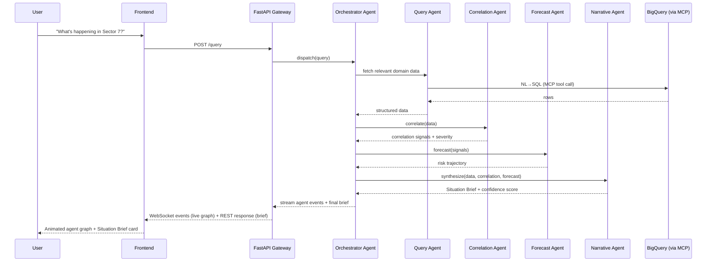
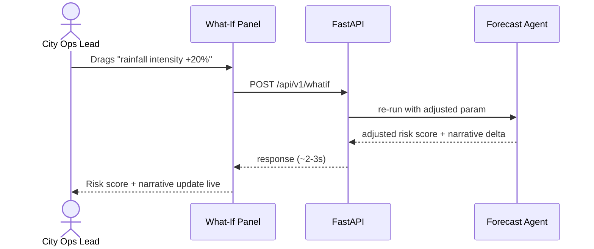
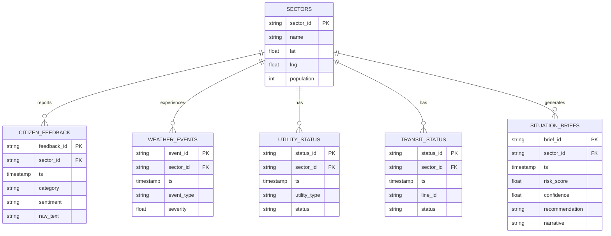

# 🛡️ AEGIS: Decision Intelligence Platform

> **AI for Better Living and Smarter Communities**
>
> AEGIS turns scattered city/community data into a natural-language decision copilot. By asking simple questions, it correlates transit, weather, utilities, health, and citizen-feedback data live in BigQuery, delivering an explainable "Situation Brief" complete with risk scores, action recommendations, and a live what-if simulator.

---

## 👥 Hackathon & Team Metadata

*   **Event:** Gen AI Academy APAC Edition Challenge — By Hack2Skill and Google Cloud
*   **Team Name:** **DecisionForge AI**
*   **Team Members:**
    *   **Hardik Bhaskar** (Lead Developer)
    *   **Snehal Prince** (Design)
*   **Core Theme:** Unified Data Analytics & Intelligence (BigQuery + ADK + agentic data agents)

---

## 🎯 The Challenge: From Data Silos to Faster Decisions

Urban operational leaders (City Ops, Disaster Responders, Utility Managers) struggle with fragmented data. When extreme weather strikes or public transit breaks down, making a decision requires manually checking weather maps, public transit schedules, power grid statuses, and incoming citizen complaints. This manual compilation eats up 30+ critical minutes.

**AEGIS accelerates and optimizes this decision cycle:**
1.  **Unified Foundation:** Consolidates live multi-domain feeds (transit, utilities, weather, citizen complaints) into Google Cloud BigQuery.
2.  **AI-Driven Orchestration:** Employs a multi-agent graph via **ADK 2.0 (Agent Development Kit)** to parse natural-language queries.
3.  **Cross-Domain Correlation:** Detects complex cascading failures (e.g., *a localized utility failure + sudden heavy rainfall → transit bottlenecks + spike in citizen complaints*).
4.  **Actionable Outputs:** Replaces static charts and tables with an explainable, cited "Situation Brief," complete with an automated risk score, mitigation recommendation, and a "What-If" parameter slider.

---

## 🏗️ System Architecture

AEGIS is built on a modern, decoupled architecture designed for fast execution and beautiful, reactive UI updates.

```mermaid
flowchart TB
    subgraph Client["Frontend — React/Vite PWA (Firebase Hosting)"]
        UI[Situation Room UI]
        Graph[React Flow — live agent graph]
        Map[MapLibre — situation map]
        Chat[NL query box]
    end

    subgraph Backend["FastAPI Backend — Cloud Run"]
        API[REST + WebSocket Gateway]
        Auth[Auth middleware]
    end

    subgraph Agents["ADK 2.0 Workflow Runtime — Agent Service (Cloud Run)"]
        Orch[Orchestrator Agent]
        Query[Query Agent]
        Corr[Correlation Agent]
        Fore[Forecast Agent]
        Narr[Narrative Agent]
    end

    subgraph Tools["MCP Tool Layer — Cloud API Registry"]
        MCPBQ[BigQuery MCP Connector]
        MCPMaps[Maps MCP Connector]
    end

    subgraph Data["Data Layer"]
        BQ[(BigQuery — analytics core)]
        FS[(Firestore — session/live state)]
        GCS[(Cloud Storage — seeded raw data)]
        VS[(Vector Search / RAG Engine — stretch)]
    end

    subgraph Models["Gemini Enterprise Agent Platform"]
        Flash[Gemini 3 Flash]
        Pro[Gemini 3.1 Pro]
    end

    Chat --> API
    API --> Auth --> Orch
    Orch --> Query --> MCPBQ --> BQ
    Orch --> Corr --> BQ
    Orch --> Fore --> BQ
    Orch --> Narr --> VS
    Query --> Flash
    Corr --> Flash
    Fore --> Flash
    Narr --> Pro
    Orch -. streamed events .-> API
    API -. Socket.IO .-> Graph
    API --> FS
    GCS --> BQ
    Corr --> Map
```

---

## 🔄 Core Decision Workflow

When a City Ops Lead queries the platform, AEGIS runs a structured multi-agent graph to construct a decision-ready situation briefing:



### ⚡ What-If Simulation Workflow
Users can dynamically adjust scenario parameters (e.g., rainfall, service downtime) to instantly simulate the impact on civic risk levels:



---

## 🛠️ Technology Stack

| Layer | Technology | Role |
| :--- | :--- | :--- |
| **Frontend** | React 18, Vite, TypeScript | App shell, robust HMR |
| **Styling** | TailwindCSS, shadcn/ui | Premium, clean layout |
| **Visualization** | **React Flow** | Renders live node/edge states as agents work |
| **Mapping** | MapLibre GL | Open-source situation map mapping anomalies |
| **Backend** | FastAPI (Python) | High-performance REST & WebSocket gateway |
| **Agent Engine** | **ADK 2.0 Workflow Runtime** | Manages graph orchestration, parallel steps, & state |
| **Database** | BigQuery (Google Cloud) | Core analytics engine storing multi-domain feeds |
| **Session Cache**| Firestore (Google Cloud) | Syncs real-time operational state & chat history |
| **AI Models** | Gemini 3 Flash & 3.1 Pro | Flash for tool calling/analytics, Pro for final reasoning |

---

## 📊 BigQuery Data Model (ERD)

The unified analytical database in BigQuery uses a clean, relational structure segmented by sector:



---

## 📈 Minimum Lovable Product (MLP) Roadmap

Our 24-hour development plan isolates high-leverage deliverables to build an engaging and stable live demo path:

| Stage / Hours | Focus Areas | Details |
| :--- | :--- | :--- |
| **Hours 0–4** | **Data Ingestion** | GCP project setup, BigQuery schemas, loading realistic synthetic feed scripts. |
| **Hours 4–10** | **ADK Agent Logic** | Writing the 4 agents (Query, Correlation, Forecast, Narrative), configuring BQ MCP tools, CLI testing. |
| **Hours 10–13** | **API Gateway** | Building the FastAPI backend with REST endpoints & WebSocket event relaying to Cloud Run. |
| **Hours 13–20** | **Interactive UI** | Building Situation Room front, MapLibre markers, and React Flow agent-graph visualization. |
| **Hours 20–24** | **Simulation & Rehearsal** | Wiring the what-if simulation sliders, final UI polish, recording the 3-minute pitch video. |

---

## 🚀 Future Vision & Scale-up

Following the hackathon, AEGIS can scale to support production-grade government deployments:
*   **Real Data Ingestion:** Connect real-time transit telemetry, weather radar feeds, and municipal ticketing systems (e.g., Salesforce/Zendesk for government).
*   **AlloyDB Memory Store:** Implement Postgres/AlloyDB-backed agent memory archives to track audit trails and historical sector events over years of city history.
*   **Role-Based Access (RBAC):** Firebase custom claim implementation ensuring citizen requests remain private, while official/admin users gain administrative query rights.
