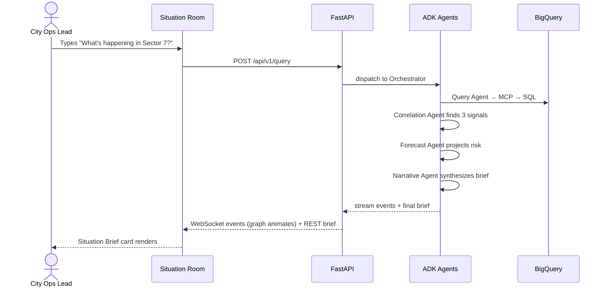
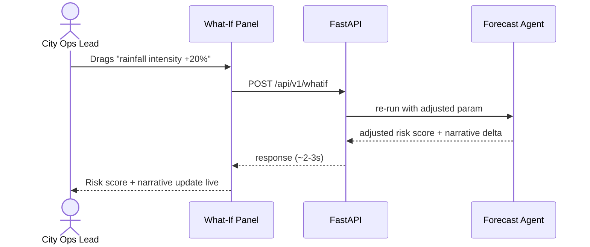
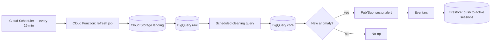
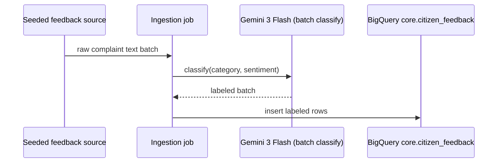

# WORKFLOWS.md — User Flows & System Workflows

## Flow 1 — Ask a Question (primary demo flow)

## Flow 2 — What-If Simulation

## Flow 3 — Scheduled Data Refresh (background system workflow)

## Flow 4 — Citizen Feedback Ingestion → Classification

## Demo Script (for the 3-minute submission video)

1. **(0:00–0:20)** Open Situation Room — map shows one amber sector. State the one-liner.
2. **(0:20–0:50)** Type the NL question → agent graph animates live → Situation Brief appears with confidence score.
3. **(0:50–1:20)** Expand generated SQL + signals — prove it's not hardcoded.
4. **(1:20–1:50)** Drag the what-if slider — risk score updates, narrative delta shown.
5. **(1:50–2:30)** Quick architecture flash (ARCHITECTURE.md diagram) — call out ADK 2.0, MCP, BigQuery, Gemini 3 by name.
6. **(2:30–3:00)** Close on impact statement — "built for cities in flood/monsoon-prone APAC regions where this decision currently takes a human 30+ minutes of cross-referencing dashboards."
